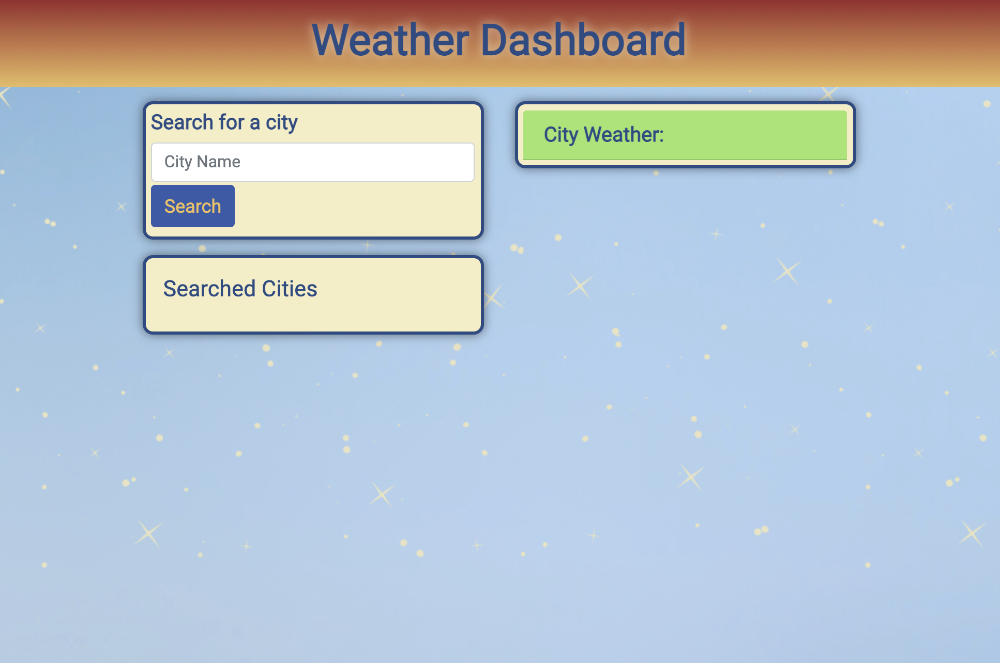
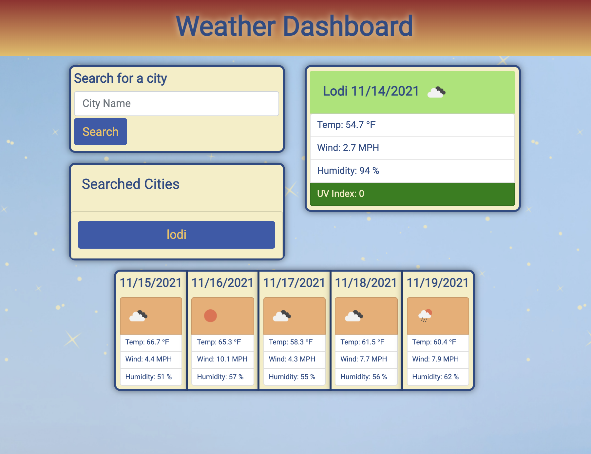
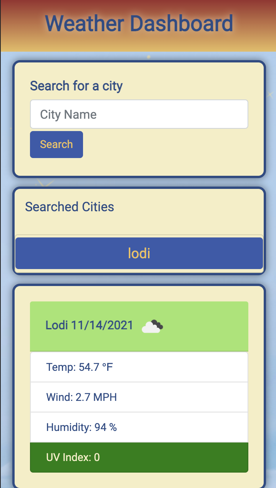
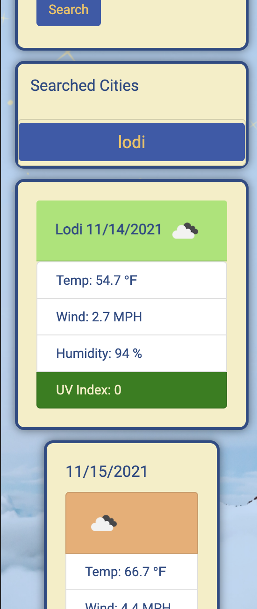

# Weather Dash
&nbsp;

## Purpose
***
To build a weather dashboard that will run in the browser and feature dynamically updated HTML & CSS.

&nbsp;

## Desired
***
To see the weather outlook for multiple cities as desired.
- Searching for a city presents current and future conditions for a city, and then the city is added to a search history list.
  - From this list, when the previously viewed city button is clicked again, current and future conditions for that city are presented.
- The results include:
  - City Name
  - Current date
  - Icon representing the conditions
  - Temperature
  - Humidity
  - Wind speed
  - UV index
    - With color indicating if the UV Index is favorable, moderate or severe

    &nbsp;

  - 5-day Forecast
    - The 5-day Forecast includes:
      - Date
      - Icon representing the conditions
      - Temperature
      - Wind speed
      - Humidity

&nbsp;

## Weather Dash URL
***
Get your weather here [weather dash homepage](https://melliedee.github.io/weatherDash/)

&nbsp;

## Languages and Resources Used
***
  
### Languages
- HTML
- CSS / Bootstrap
- Javascript/jQuery

### Resources
- Openweathermap api & icons - for weather data
- Luxon for date & time manipulation
- Google fonts
- Canva for background pic

&nbsp;

## Screen Shots
***

&nbsp;

&nbsp;

&nbsp;

&nbsp;

### Resources I like or am inspired by
***
https://openweathermap.org/
endpoint for call:

https://stackoverflow.com/questions/44177417/how-to-display-openweathermap-weather-icon
and  https://github.com/yuvraaaj/openweathermap-api-icons

https://www.iso.org/iso-3166-country-codes.html

https://colorhunt.co/palette/15274436759161d2b49dfdc7

for toUpper info:
https://stackabuse.com/javascript-check-if-first-letter-of-a-string-is-upper-case/

accessing data from JSON
https://idratherbewriting.com/learnapidoc/docapis_access_json_values.html

button
https://www.encodedna.com/javascript/dynamically-create-html-elements-using-createElement-method.htm

API- current icons
https://openweathermap.org/weather-conditions
https://stackoverflow.com/questions/44177417/how-to-display-openweathermap-weather-icon

DateTime Luxon
https://morioh.com/p/2c6026208e5b

https://stackoverflow.com/questions/66553494/how-to-parse-unix-timestamps-with-luxon

https://typescript.hotexamples.com/examples/luxon/DateTime/fromMillis/typescript-datetime-frommillis-method-examples.html

clearing data
https://betterprogramming.pub/dynamically-removing-children-from-a-dom-element-in-javascript-new-node-new-you-6143dabaea89